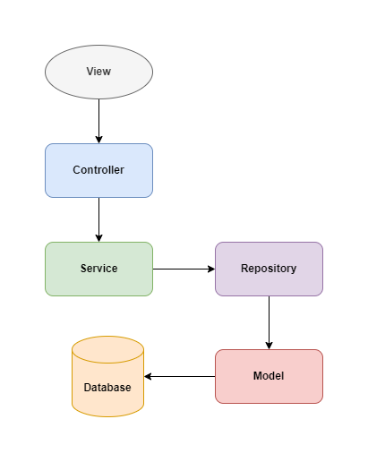
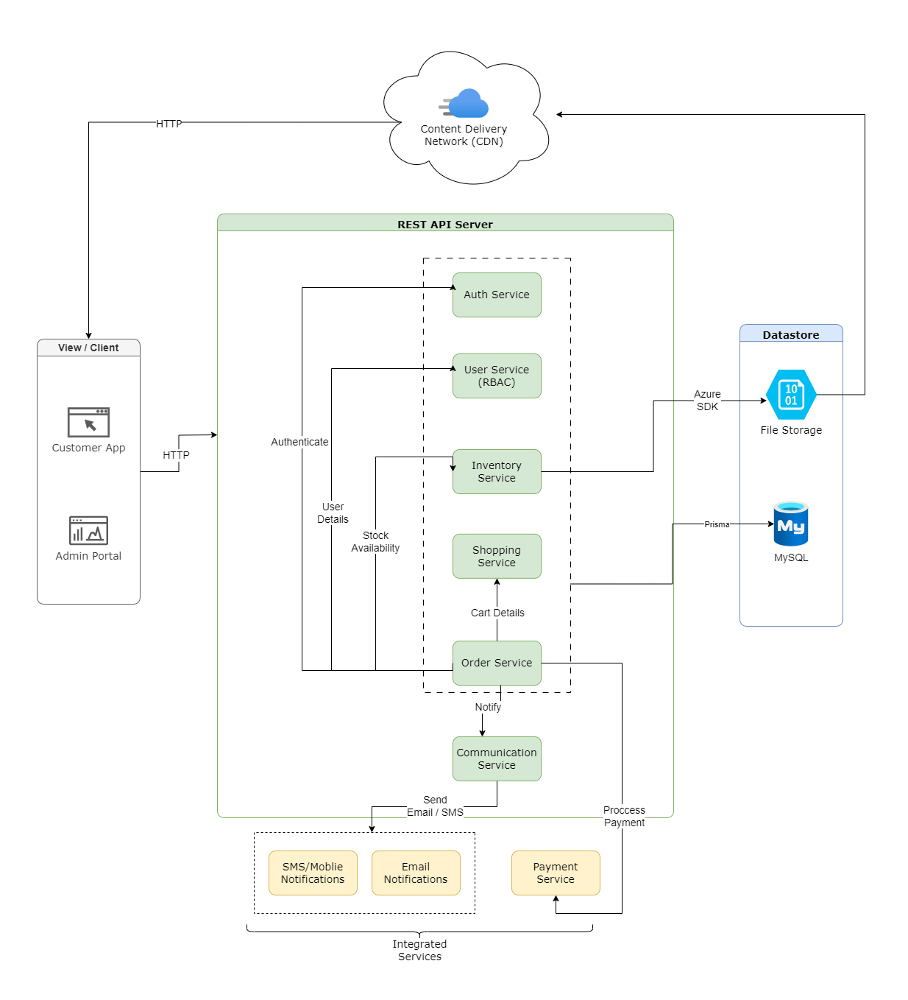
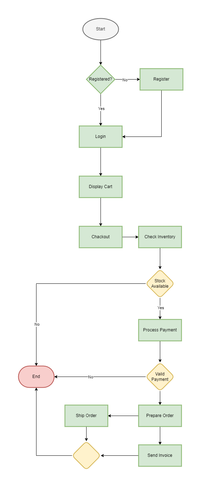

# Engineering Requirements Document (ERD) - Resala

## Table of Contents

- [Engineering Requirements Document (ERD) - Resala](#engineering-requirements-document-erd---resala)
  - [Table of Contents](#table-of-contents)
  - [Introduction](#introduction)
  - [System Overview](#system-overview)
  - [Functional Requirements](#functional-requirements)
  - [Non-Functional Requirements](#non-functional-requirements)
  - [System Architecture](#system-architecture)
  - [Storage](#storage)
  - [Server](#server)
  - [Client](#client)
  - [Hosting](#hosting)
  - [Activity Diagrams](#activity-diagrams)
    - [Order Fulfillment Process](#order-fulfillment-process)

## Introduction

The Resala project is a web application that allows users to buy clothes online. The  
application will have a web client and a server that provides a RESTful API.

## System Overview

The system will consist of a web client and a server (client-server architecture) that provides a RESTful API.  
The web client will be a single-page application (SPA) that uses Angular. The server will be a Node.js application that uses Express.

## Functional Requirements

The system will have the following functional requirements:

1. Users can create an account.
2. Users can log in to their account.
3. Users can view a list of products.
4. Users can view the details of a product.
5. Users can add a product to their cart.
6. Users can remove a product from their cart.
7. Users can view their cart.
8. Users can place an order.
9. Users can view their orders.

## Non-Functional Requirements

The system will have the following non-functional requirements:

1. The system will be secure.
2. The system will be scalable.
3. The system will be reliable.
4. The system will be easy to use.

## System Architecture

The system architecture will follow the monolithic architecture pattern as shown in the following high-level diagram:

The system will have the following architecture:

1. Web Client: The web client will be a single-page application  
   (SPA) that uses Angular.
2. Server: The server will be a Node.js application that uses Express.
3. Database: The system will use a database to store data.  
   The database will be an SQL database that uses MySQL.
4. File Storage: The system will use a file storage system to store images.  
   The file storage system will be a cloud storage service that uses Azure Blob Storage.

The web client will communicate with the server using a RESTful API.
The server will communicate with the database using an ORM (Object-Relational Mapping) library.

## Storage

The system will use a database to store data. We'll use a relational database (schema follows)  
The database will be an SQL database that uses MySQL.

### Entities

- User
- Address
- Category
- Product
- Stock
- Cart
- Wishlist
- Order
- Payment
- Review

The system will use a file storage system to store images. The file storage system will  
be a cloud storage service that uses Azure Blob Storage.

### Entity Relationship Diagram (ERD)

## Server

A simple HTTP server is responsible for authentication, and serving stored data.

- Node.js is selected for implementing the server for speed of development.
- Express.js is the web server framework.
- Prisma to be used as an ORM.

### Auth

A simple JWT-based auth mechanism is to be used, with passwords encrypted and  
stored in the database. OAuth is to be added later for Google + Facebook.

### API

You can find the API documentation [here](https://resala-app.onrender.com/api-docs/)

## Client

The web client will be a single-page application (SPA) that uses Angular.
The Admin Dashboard will be a single-page application (SPA) that uses React.

## Hosting

The code will be hosted on GitHub.

The web client will be hosted using any free web hosting platform such as Vercel  
or Netlify. A domain will be purchased for the site, and configured to point to the  
web host's server public IP.

We'll deploy the server to Heroku or a similar free hosting platform. A domain will be  
purchased for the site, and configured to point to the web host's server public IP.

## Activity Diagrams

### Order Fulfillment Process

